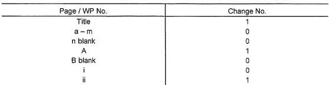
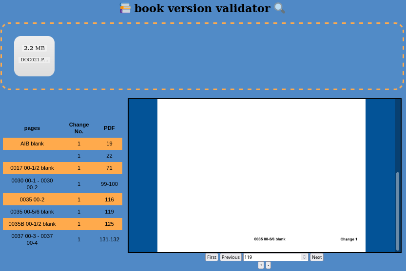

# book version validator

## background
We have a lot of books that being scanned into pdfs these days.
Sometimes we receive updates for these books and have to replace some pages.
In order to make sure that the scanned book is up to date, we have to follow the list of the updated pages and verify that they are in the correct version.

a sample change table may look like:



and page ```ii``` which should be in version 1, will have the following footer:


this project use OCR (Optical character recognition) to reconstruct the table from the actual pdf and should produce the following table:

| page  	| Change No. 	|
|-------	|------------	|
| Title 	| 1          	|
| A     	| 1          	|
| ii    	| 1          	|

(```Change No. 0```, not relevant here..)

## webapp
The UI looks like:



The user should drag and drop the pdf into the dashed square.
After the upload and the ocr on the server side the UI looks like:


while the table on the left side of the screen contains the constructed table. 

*the pdf column contains the page range in the pdf, helpful when the ocr doesn't recognize the page numbers (as happend in the second row)*

On the right side of the screen there is a basic pdf viewer which allows to view the pdf itself. clicking on cell in the table redirects to that page on the pdf.

## algorithm
1. break the pdf into sequence of images.
2. preform ocr on the footer of each image.
3. if the footer contains the string ```Change ```, store the page number and the version.
4. group the list of changes into ranges. for example: [1,2,3] => 1-3
5. construct and display the table.

## deployment

The file ```iterate_pages.py``` contains all the logic - so it can be used as a module.

For our use case we warped it with a flask web app which allows the user to drag a pdf into the webapp and view the result.
